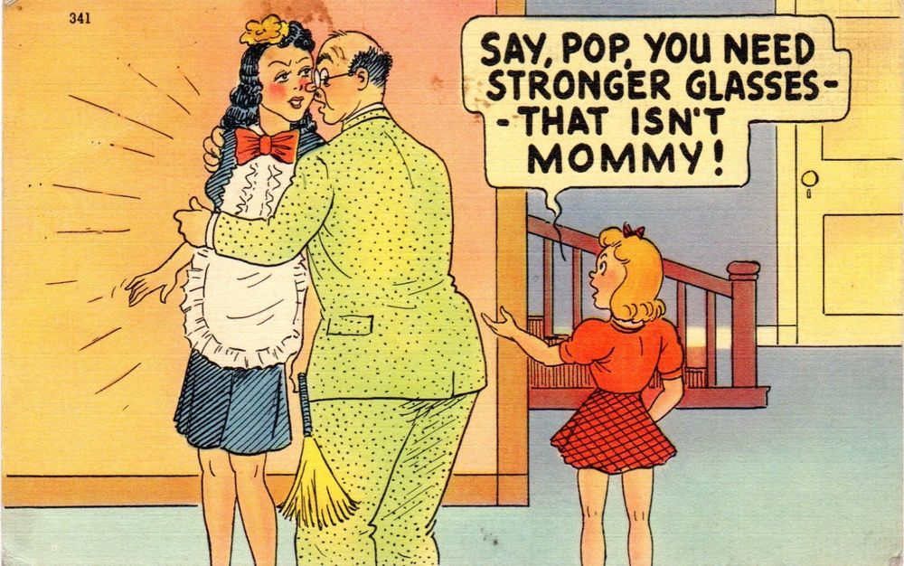

# Bangmaid

Tldr "Men" complain about women not being wife material while not also
complaining that men aren't husband material (in the "Trad" sense). This is
immature at best

---

Most men want a bangmaid not a wife (a maid who you can fuck). They want
a loving mummy that they can cummy.

> She should dress pretty, tidy the house, cook, and let me creampie her
whenever I want. She will feed, bathe, and dress my growing brood. She will be
happy because I will pay for all of this and deep down this is what women want

They resent women for going off and having lots of sex (not with them). They
create a standard for themselves, and then hold themselves up as the paragons
of it and hate women for not loving them for it. They lament women not
maintaining traditional roles, while acting just as modern and mulatto as them.
And it all stems from immaturity.

By the time a man is a man he should realise that having a wife, family, and
home isn't an Xbox. You don't just get to buy it and then let the good times
roll in.

Idiots will buy a dog thinking it's a buddy who will be happy to see them. But
it's a lot of feeding, bills, grooming, training, and walking. You don't get
the good unless you put in, and you put in every day. And it's the same thing
with a wife, except unlike a dog a woman (a good woman) gets to chose if she
wants to be part of the arrangement. 

And they look at if a man can handle the responsibility of a pregnant wife, or
a new born child, or a household of children. Can he be trusted to keep things
in order without a mummy barking orders? Can he clean, cook, drive, work,
entertain, listen, and repair (not to the standard of a 20 year old bachelor,
but to the standard of a house proud matriarch)? How does he treat people he's
angry with, his mother, his subordinates, people who disagree with him? Can he
take care of himself, will he make her feel cherished? Will she feel valued or
just valuable? Will she be secondary to work, car, games, "the movement", the
boyz, the porn?

I wont just pick on [REDACTED], I don't know him that well, but when I see boys of
that type I don't see the things that wives and mothers need. I don't see
someone embodying the right things, someone advocating for them, or even
someone aware of them. I just see an angry kid ignorant of his own humanity.

I think it's symptomatic that incest has fallen into vogue, young men are only
able to view feminine qualities through their dicks. No mainstream right wing
figure has managed to articulate a positive vision of a woman who isn't
a bangmaid or enumerated the responsibility of a husband (in a way that rebukes
and condemns their audience).

-----

My point is not "incels are **ALL** angry manchildren/misogynistic and that's
why they're single". My point is that for men that want a "wife" there are
responsibilities commensurate with the privileges. And some men (specially the
[REDACTED] crowd) who loudly lament the state of modern women are personally
not meeting any kind of patriarchal standard.

Holding men to any kind of standard isn't exclusively a feminist talking point,
nor is it the only reason why they're single. However, I find
it hypocritical and frustrating when "thought leaders" talk about how women
need to improve without also addressing the faults in modern men (i.e. their
audience).

Others have pointed out that men acting more "Trad" won't result in more of
them getting married, because that's not what women are selecting for. Instead
they should focus on other things (not women or strategies that work). If this
is roughly the same position as [REDACTED], I'll take your word for it. In
response to that I say I don't care. I'm not a utilitarian. You don't do things
primarily for results, especially when those things have a clearly articulated
moral dimension. Either you're having a big LARP as being
Trad/Catholics/masculine or you need to act morally even if it disadvantages
you. Especially as a man.

Whether or not a man choses to act one way or another should be based first on
morality, not utility. This is one fundamental disagreement I have with most
"RW" thinkers.

This applies to:

- what dating strategy should be applied (don't be a degenerate, even if it
  mean a you don't get laid),
- how [REDACTED] should talk to his audience (he shouldn't moderate his views
  based on what gets him paid)
- how he should personally behave (he should stop being the bad kind of
  misogynist and be the good kind)

Sexual selection has always been a competition with winners and losers.
The idea that you (or a [REDACTED]) wouldn't participate because you might lose is
extremely telling

----

The basis for this brand of MGTOW is that even if you do all the right things
you probably won't get a wife, so you should focus your energy on other things.
But it's based on the incorrect beliefs that marriages are on average failures
and there are no good women to marry. Not to mention we have wildly diverging
ideas of the right things

People shouldn't abandon marriage (or other traditional institutions)
because the national statistics are bad in aggregate, because there is lots and
lots that can be done to ensure that your marriage will succeed. Divorce
statistics are especially bad as they include 4th marriages and "demographics"
that you aren't a part of.

I'm not defending the current system, I'm asking why [REDACTED], a famous
handsome man who feels qualified to give out advice and condemn women, can't
get a wife. Plenty of people are able to. Everyday people are getting married,
having kids, and not getting divorced. And I don't care about the average
I care about the top achievers.

I'm not talking about an ideal scenario. I'm talking about right now in the
`$CURRENT_YEAR`, how should someone be acting in order to obtain a wife. There
is competition at play here, and if a good woman is 1 in 100, then you should
be competing for her or start acting a little more humble (like considering
that the reason [REDACTED] is single is because the women he wants don't don't
him).

When black women complain that they can't get find a monogamous 6 foot black
man making 1 million a year it isn't that those men don't exists, it's that
those men don't want obese black single mothers. Same thing here, but with
E celebrities and Trad wives.

-----

I'm not saying that it's wrong to want a woman
of virtue. Precisely the opposite, you're likely correct in wanting the things
you want. The problem is men wanting to have a virtuous wife without being
a virtuous husband. Definitionally, you can not have a wife without a husband.
Wanting privileges (like a homemade lunch and many many sons) also comes with
responsibilities (caring for a wheelchair-bound woman for 8 weeks after her
C section and going without sex, sleep, porn, games, friends, alone time, and
recreation for that time). A bangmaid is a wife with no responsibilities and
many incels (and married men) are resentful that they can't have that.

You're right to complain about the state of women, and how few good ones there
are. But we should also hold men and ourselves to a higher standard.

