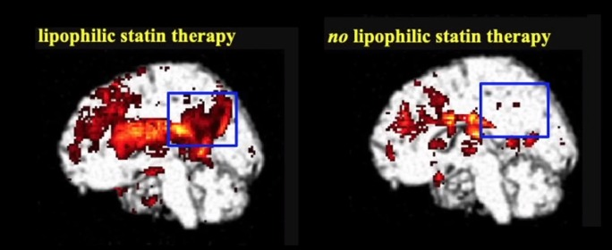

# Statins

> the indigo dyer wears white trousers
> -- Japanese Proverb

## Short Answer

Statins are not worth it.

1. Statins do not increase life expectancy for people who have not had a major
   adverse cardiovascular event.
1. Statins have numerous known side effects:
   1. Neurological: headache, dizziness, memory problems, sleep problems
   2. Intestinal: constipation, diarrhoea, indigestion,
   3. Sexual: reduced sex drive and erectile dysfunction
   4. General: hepatitis, pancreatitis, low blood platelet count
2. Statins have numerous hidden major side effects:
   1. Abstaining from statins can reverse the symptoms of dementia. Resuming
      statins resumes cognitive decline.
   2. Statins significantly increase the risk of severe neurological conditions
      like ALS. 
   3. Statins increase the risk of diabetes.
3. For the majority of people dietary changes will have greater benefits and
   fewer risks than statins.

## Long Answer

Cholesterol is a molecule produced by the liver and brain that is essential for
healthy body function. "Cholesterol functions as a precursor molecule in the
synthesis of vitamin D, steroid hormones (e.g., cortisol and aldosterone and
adrenal androgens), and sex hormones (e.g., testosterone, estrogens, and
progesterone)"[1]. Cholesterol is a building block for cell membranes.
"Cholesterol is also a constituent of bile salt used in digestion to facilitate
absorption of fat-soluble vitamins A, D, E, and K." [1]

Doctors prescribe statins to reduce cholesterol levels based on the belief that
this improves health. This is false. Statins are the most common
cholesterol-lowering drugs. "Statins disrupt production of cholesterol by
blocking an enzyme inside the liver cells. This results in less cholesterol
being released into the bloodstream." [2]

But what are the actual benefits of statins?

- A meta-analysis of 11 studies ‘did not find evidence for the benefit of
  statin therapy on all-cause mortality in a high-risk primary prevention
  set-up.' [3]
- A meta-analysis of 11 studies found that statins increased life expectancy
  a total of 4 days. [4]
- To prevent a single major adverse cardiovascular event (MACE) in 1 person
  would required that 100 people take statins for 2.5 years. 'There is no
  evidence of a mortality benefit'. [5]
- A meta-analysis of 21 studies showed that statins provided a 0.8\% reduction
  in the absolute risk of all-cause mortality (9\% in terms of relative risk).
  [6]
- Patients with bad TG/HDL ratio receive some benefits when on statins.
  Patients with good TG/HDL ratio receive no benefits. [7]
- Statins are perscribed to reduce cholesterol, lower total cholesterol is
  associated with higher mortality. [8]

In summary:

> When healthy patients without cardiovascular disease are prescribed statins
they do not live longer, and they have only a marginal reduction in the risk of
ischemic events. Furthermore, statins cause numerous side effects which
substantially limit their net benefit. These tradeoffs are even more lopsided
in elderly patients treated for primary prevention, in whom statin therapy does
not lead to a reduction in mortality or ischemic events and has the potential
for significant harms. [9]

But what are the side effects of statins?

Firstly, there are the common side effects which your doctor probably told you
about [10]:

- headache, dizziness, memory problems, sleep problems
- digestive system problems, such as constipation, diarrhoea, indigestion or
  farting
- muscle pain, pins and needles, low blood platelet count
- hepatitis, pancreatitis, and
- hair loss, reduced sex drive and erectile dysfunction

But then there is a host of side effects that are more severe and slower to
detect:

- For patients with preexisting dementia, stopping statins for 6 weeks reversed
  cognitive decline. Resuming statins resumed cognitive decline. [11]
- Statin use doubles the risk of dementia over eight years. [12]
- Stains cause a 'highly significant decline in metabolism of posterior
  cingulate cortex -- the region of the brain known to decline the most
  significantly in the earliest stages of Alzheimer’s disease.' [12]

- 10700% increase in reports of motor neuron disease (MND) for patients on
  statins. [13]
- Statins increased the risk of incident diabetes by 9% ( meta-analysis of 13
  randomized placebo controlled and standard care controlled trials (including
  JUPITER and WOSCOP) with 91,140 participants.) [14]
- Diabetes risk is higher on higher doses of statins (12% higher on
  intensive-dose statin therapy compared with moderate-dose therapy) [14]
- Common statins can increase the risk of new onset diabetes by 25%.
  (meta-analysis of 17 randomized controlled trials). [14]
- The risk of incident diabetes is greater in elderly patients. [14]
- The risk of incident diabetes is greater in women. [15]

In summary:

> The literature indicates that statin therapy for both primary and secondary
prevention of CVD [cardiovascular disease] is not warranted for individuals on
an LCD [low-carb-diet] with elevated LDL-C who have achieved a low
triglyceride/HDL ratio. [16]

# Afterword

Dr Akira Endo's research led to the development of the first statin
pharmaceuticals. When asked why he didn't take statins when he was prescribed
them by his doctor he replied "the indigo dyer wears white trousers"; referring
to the merchant minimizing personal exposure to toxic products while profiting
from their sale. [17]

## Forbidden Lore

If pseudo-vaxxx cause injuries to the heart, and if injuries to the heart cause
cholesterol to build up in and around the damaged arteries, then we should
expect that in the next few years many people will receive sudden diagnoses of
cholesterol build up around the heart. These individuals will receive
prescriptions of statins or increased prescriptions. These individuals may have
no diagnosis of vaxxx related injuries and their sudden development of heart
conditions may occur in spite of measures to improve heart health.

If there is a sudden uptick in the rate of statin prescriptions, especially for
injuries unrelated to diet and lifestyle, then we should expect that:

1. (for those who are responsive to statins) that their heart health will
   decline as they'll no longer have the cholesterol to attenpt to repair the
   vaccine injuries.
1. that statin side effects affecting the liver will increase as the body will
   try to compensate for the statins and heart injuries.
1. rates of dementia will sky rocket (something something 'long covid').

## Appendix N

Special thanks to:

- Dr Paul Mason (@drpaulmason) 
- Dr David Diamond (@ldlskeptic)
- The Weston A. Price Foundation

# Bibliography

1. J. I. Huff T Boyd B. “Physiology, cholesterol.” (2022), [Online]. Available: https://www.ncbi.nlm.nih.gov/books/NBK470561/.
2. I. American Heart Association. “Cholesterol drugs.” (2022), [Online]. Available: https://watchlearnlive.heart.org/?moduleSelect=chldrg.
3. K. K. Ray, S. R. K. Seshasai, S. Erqou, et al., “Statins and AllCause Mortality in High-Risk Primary Prevention: A Meta-analysis of 11 Randomized Controlled Trials Involving 65 229 Participants,” Archives of Internal Medicine, vol. 170, no. 12, pp. 1024–1031, Jun. 2010, issn: 0003-9926. doi: 10.1001/archinternmed.2010.182. eprint: https://jamanetwork.com/journals/jamainternalmedicine/articlepdf / 416105 / ira05004 \ _1024 \ _1031 . pdf. [Online]. Available: https://doi.org/10.1001/archinternmed.2010.182.
4. M. L. Kristensen, P. M. Christensen, and J. Hallas, “The effect of statins on average survival in randomised trials, an analysis of end point postponement,” BMJ open, vol. 5, 2015. doi: https://doi.org/10.1136/bmjopen-2014-007118.
5. L. C. Yourman, I. S. Cenzer, W. J. Boscardin, et al., “Evaluation of time to benefit of statins for the primary prevention of cardiovascular events in adults aged 50 to 75 years: A meta-analysis,” JAMA internal medicine, vol. 181, no. 2, pp. 179–185, 2020. doi:https://doi.org/10.1001/jamainternmed.2020.6084.
6. P. Byrne, M. Demasi, M. Jones, S. M. Smith, K. K. OBrien, and R. DuBroff, “Evaluating the Association Between Low-Density Lipoprotein Cholesterol Reduction and Relative and Absolute Effects of Statin Treatment: A Systematic Review and Meta-analysis,” JAMA Internal Medicine, vol. 182, no. 5, pp. 474–481, May 2022, issn: 2168-6106. doi: 10.1001/jamainternmed.2022.0134. eprint:https://jamanetwork.com/journals/jamainternalmedicine/articlepdf/2790055/jamainternal\_byrne\_2022\_oi\_220004\_1650900292.38571.pdf. [Online]. Available: https://doi.org/10.1001/jamainternmed.2022.0134.
7. C. M. Ballantyne, A. G. Olsson, T. J. Cook, M. F. Mercuri, T. R. Pedersen, and J. Kjekshus, “Influence of low high-density lipoprotein cholesterol and elevated triglyceride on coronary heart disease events and response to simvastatin therapy in 4s.,” Circulation, vol. 104, no. 25, 2001. doi: https://doi .org/10.1161/hc5001.100624.
8. J. Charlton, R. Ravindrarajah, S. Hamada, S. H. Jackson, and M. C. Gulliford, “Trajectory of total cholesterol in the last years of life over age 80 years: Cohort study of 99,758 participants.,” The journals of gerontology. Series A, Biological sciences and medical sciences, vol. 73, no. 8, pp. 1083–1089, 2018. doi: https://doi.org/10.1093/gerona/glx184.
9. V. Durai and R. F. Redberg, “Statin therapy for the primary prevention of cardiovascular disease: Cons,” Atherosclerosis, vol. 356, pp. 46–49, 2022, issn: 0021-9150. doi: https://doi.org/10.1016/j.atherosclerosis.2022.07.003. [Online]. Available: https://www.sciencedirect.com/science/article/pii/S0021915022013442. 
10. NHS. “Side effects: Statins.” (2022), [Online]. Available: https://www.nhs.uk/conditions/statins/side-effects/.
11. K. P. Padala, P. R. Padala, D. P. McNeilly, J. A. Geske, D. H. Sullivan, and J. F. Potter, “The effect of hmg-coa reductase inhibitors on cognition in patients with alzheimer’s dementia: A prospective withdrawal and rechallenge pilot study.,” The American journal of geriatric pharmacotherapy, vol. 10, no. 5, pp. 296–302, 2012. doi:https://doi.org/10.1016/j.amjopharm.2012.08.002.
12. P. Padmanabham, S. Liu, and D. Silverman, “Lipophilic statins in subjects with early mild cognitive impairment: Associations with conversion to dementia and decline in posterior cingulate brain metabolism in a long-term prospective longitudinal multicenter study,” Journal of Nuclear Medicine, vol. 62, no. supplement 1, pp. 102–102, 2021, issn: 0161-5505. eprint: https://jnm.snmjournals.org/content. [Online]. Available: https://jnm.snmjournals.org/content/62/supplement_1/102.
13. B. Golomb, A. Verden, A. Messner, and et al., “Amyotrophic lateral sclerosis associated with statin use: A disproportionality analysis of the fda’s adverse event reporting system.,” Drug Saf, vol. 41, pp. 403–413, 2018. doi: https://doi.org/10.1007/s40264-017-0620-4.
14. U. Aiman, A. Najmi, and R. A. Khan, “Statin induced diabetes and its clinical implications.,” Journal of pharmacology and pharmacotherapeutics, vol. 5, no. 3, pp. 181–185, 2014. doi: https://doi.org/10.4103/0976-500X.136097.
15. A. L. Culver, I. S. Ockene, R. Balasubramanian, et al., “Statin Use and Risk of Diabetes Mellitus in Postmenopausal Women in the Women’s Health Initiative,” Archives of Internal Medicine, vol. 172, no. 2, pp. 144–152, Jan. 2012, issn: 0003-9926. doi: 10.1001/archinternmed.2011.625. eprint: https://jamanetwork.com/journals/jamainternalmedicine/articlepdf/1108676/ioi110011\_144\_152.pdf. [Online]. Available: https://doi.org/10.1001/archinternmed.2011.625.
16. D. M. Diamond, B. T. Bikman, and P. Mason, “Statin therapy is not warranted for a person with high ldl-cholesterol on a low-carbohydrate diet.,” Current opinion in endocrinology, diabetes, and obesity, vol. 29, no. 5, pp. 497–511, 2022. doi: https://doi.org/10.1093/gerona/glx184.
17. L. Jordan. “Cholesterol drug scientist receives americas nobel: Endo pinpointed basis for statins.” (2008), [Online]. Available: https://blogs.scientificamerican.com/news-blog/cholesterol-drug-scientist-receives-2008-09-12/.
