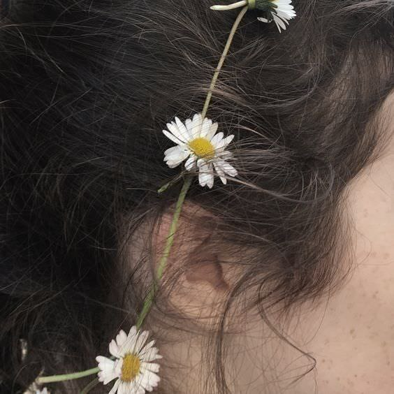

# Gluten-free Autismo: how to get an aspie gf

I wanted to keep this short but to do it justice it’s going to have to be an
effort post. How to get an Aspergers wife:

To lay the groundwork we must understand what kind of women exist in the world
today. There are 3 kinds: the Sheltered, the Thots, and the Stubborn.

The Sheltered are the basic state of all women. The Sheltered are women who
have not yet been subjected to the influence of the world. Some girls stop
being Sheltered at 12, some 21. Many men these days focus on finding their
perfect big tiddy naive milk maid Waifu who never left her parents farm, never
heard of a toktik, and never learned to read. While they exist, if you’re not
part of that community (you’re here, so obviously you’re not), then you
aren’t going to end up with a virgin highschool sweetheart. Many men still
devote themselves to the Sheltered; many grow despondent because the only
alternative they see is the Thot.

The Thot is the type of woman who has accepted the programming. The extent to
which she accepts it varies, but in all likelihood she has imbibed liberalism
and it defines her. She has drunk the kool-aid, eaten the wahmen ramen. She is
an NPC with set dialogue, beliefs, and values. She believes the current thing.
Obviously the process isn’t instantaneous, but after a decade or two of this
it’s impossible to undo the damage. Her capacity for sovereignty will have
atrophied away entirely.

The third type is the Stubborn. For a wide variety of reasons, the Stubborn has
dissented from “the current thing”. She doesn’t fit. She’s an anime protagonist
dyeing their hair from pink to brown to fit in. She probably desperately wants
a normal life, but can’t square the circle. This isn’t to say that she is
completely immune to the culture, merely that she can think for herself. The
Stubborn might be the way they are because they were:

- raised in a left wing household that told her that liberal feminism was made
  up by corporations to sell her diet Pepsi
- experienced a traumatic event that shattered her ability to accept the
  consensus opinion
- burned herself out on the meat carousel and can’t go along with it anymore;
  or,
- she’s an aspie who “can’t into social cue”

Before we dissect the aspie gf, we should go over some caveats.

The Stubborn may have a past. Women are subject to the same kinds of social
pressures to conform as men, but they are more acute and felt more sharply.
A Stubborn may be doing their absolute best to “pass for normie”. She may have
tried things (that she now rejects) in the hope that it is as good as everyone
says it is; the aspie is especially likely to fall into this trap. This might
present as something intolerable to the online sperg, but it’s worth bearing in
mind that the Stubborn might be delightful wife material EXCEPT she has
mistakes in her past of which she bitterly repents. It’s up to you to decide
how realistic and humble you are willing to be.

The aspie is not the only kind of Stubborn. I personally have only seen men
capture an aspie wife for themselves, so I can only describe that process.
I can’t tell you how to turn a eco terrorist vegan gf into an eco fascist gf.

The Stubborn will be somewhere on a spectrum, she may reject casual sex and
have latent racism, but she might still hold many feminine priors (be nice to
refugee children). She may also still want to be a normie. This means that even
if you bag a girl with potential, it doesn’t mean that she’ll change and become
a wife for you specifically.

I intend to describe how to identify an aspie gf and how to attract one, but
first I will touch on the other two key things to be done.

For most of you this will be the most difficult step and I expect this is where
90% of you will fail; firstly you must meet more people and take a genuine
interest in them. I would avoid degeneracy of every kind, but instead go to
church, volunteer for your local land care group, talk to people at the dog
park, say hello to girl you see every day at the bus stop, become friends with
your friend’s friends. Your goal is simply to develop friendships and to know
them better. If you do not, you will not meet enough people to find the 1 in
1000. In many ways this is a numbers game and you can’t find if you don’t look
widely enough.

The second thing to do is to turn people away. If you are earnestly attempting
the first thing, then you will find women who are willing to have sex with you.
Or play wife with. Or have you spend money on them. These women, however, will
not be the women you want. They will be early stage Thots, who still believe
they can have it all. They will have a past, something they can not yet confess
and repent of. They will want to eat their cake and have it too. They will want
the thing that the world offers them and you will never be able to have the
life you want with them. You must turn them away if you are to find the aspie
gf.

There are two ways to identify the aspie: 1) stumbling blocks 2) her symptoms.

Stumbling blocks are topics and questions that may cause a hidden Stubborn to
inadvertently reveal herself. Stumbling blocks are often topics where canned
answers could be given, but the Stubborn can’t prevent themselves from giving
a more detailed or nuanced answer. The assumption underlying this is that the
normie doesn’t actually know anything about things, but instead unquestioningly
parrots their lines about Current Thing. If you can trick a Stubborn into
deviating from the script then you can learn what kind of girl she is. As an
aside, her answer may come in the form of: I would never tell someone how to
behave, but personally X isn’t for me. That’s early stage noncompliance with
NPC programming and a very good sign.

Example stumbling blocks:

- any nuance on the topic of abortion
- aversion to oral birth control medication
- meaningful criticisms of feminism
- advocating for male headship
- rejection of casual sex culture, disapproval of promiscuity
- knowing who Ron Paul, Kaczinsky, Evola, or Rothbard are (simply knowing what
  they weren’t taught is a good sign) (don’t forget the libright to authright
  pipeline)
- engaging in non normie hobbies. Engaging in male hobbies, without engaging in
  thirst bait. 
- knowing what the terms microplastic, xenoestrogen, fractional reserve
  banking, vril, hypergamy, or soil depletion refer to
- nearly any topic where she takes a third position that questions the
  mainstream left/right opinions
- There are many many more. A word of caution, there are many topics in which
  diversity of opinion is still tolerated. Many women are still uncomfortable
  with trannies and will voice this in private; this tells you nothing as even
  normies will do this. On the other hand, disapproval of gays is a big green
  flag as that is anathema to current NPC programming. 

Symptoms refers to any of the symptoms or coping strategies employed by someone
living with Aspergers. For women this is poorly understood and documented. Many
of the women who will meet the criteria that we have set (Stubborn without too
much past) may have none of these. I have included them, however as women will
be significantly more likely to reveal this kind of information than they will
their political beliefs. Lastly, having Aspergers doesn’t always mean that
they’re a Stubborn, it’s just another indicator.

Symptoms include:

- a restricted palate: many aspies have sensory issues and do not enjoy certain
  foods. They will often cite things like “texture” as a reason, rather than
  taste. They may self describe as picky. They might call themselves
  vegetarians, not because they are, but in public it’s easier than having to
  explain why they can’t eat more than three mouthfuls of most meat. They may
  say they don’t like X food and then eat it later but only in a specific kind
  of meal, because that specific preparation avoids the texture/taste/density
  issue which she actually has with X food normally 
- sensitivity to light: look out for large sunglasses at all times of the day
  or continuous hat wearing
- obsessive personality
- bluntness and candidness atypical for women, speaks directly and honestly
  more often than most women 
- rejection of feminity and flirting with androgeny / lesbianism (with reason)
  [(see my posts on what causes lesbians)](404) (once you create a safe context
  for her to delight in being feminine, she will likely embrace more feminine
  habits. Don’t assume the lonely, defensive, androgynous aspie can’t become
  a thriving feminine wife when properly supported and encouraged)
- hypo sensitivity to temperature: most women are more sensitive to cold than
  men, if a woman doesn’t feel the cold or doesn’t realise that she is cold
  until she is sneezing, then she may have sensory issues related to
  temperature
- difficulties with ambiguity
- non compliance with typical feminine behaviour: as social cues are not
  intuitive to them they may engage in many logical behaviours that make them
  “weird” for a girl. This might include masculine hobbies, low use of makeup,
  not pretending to be dumb around men, social mistakes typical of men (e.g.
  callousness)
- annoyed easily by buzzing sounds, flickering lights, and other annoying stuff
  (disproportionately annoyed)
- really really hates floors or surfaces that are sandy, dirty, or sticky to
  touch
- struggles to hear properly in crowded environments
- hates things around her neck, look for women who wear extremely loose
  necklaces or none at all, or avoids high-necked clothing and accessories such
  as tight scarves
- has a weighted blanket, likes to be crushed
- prefers that some of her clothes are either extremely tight or extremely
  loose (normally one way or the other - a pattern where she avoids totally
  loose or very tight clothes will stand out if you compare her typical dress
  to the current local fashions)
- extremely particular about food preparation

This is not an exhaustive list.

Lastly, we turn to what she wants. If you've read this far then you likely want
an aspie gf, but if you want to obtain one then you'll need to offer what she
wants.

An aspie wife wants the following:

- the acceptance that other woman look for in the world, but through you
  instead of via broad social acceptance 
- all the things women normally want

I am working on a manifesto outlining what I believe to be a more correct
understanding of what women want. To summarise:

- to feel as if she is the prize. She wants to be precious and adored. To feel
  as if you are a patriot for her. You should fight and die for her honour,
  even when she gets pregnant, old, or ill. She should know that as long as she
  remains faithful that she will always have you.
- to have no unmet needs. When a woman gives a man children she does so by
  exchanging her health, safety, desirability to other men, and autonomy. When
  she looks at you she must know that her and the children she gives you will
  be fed, clothed, sheltered, and kept safe. She must know that you can meet
  your family's needs materially, emotionally, socially, spiritually, and
  intellectually. (One of these needs will be feeling that she is contributing
  to your betterment, and you must allow her to do this)
- she must be able to take pride in her territory. Women are territorial
  spirits known through their energies and emanations. A woman seeks to lay
  claim to what is hers and her sense of self grows to encompass it. Her "body"
  includes the things that she tends to. When you become hers, she will take
  pride in you, and insults to you will wound her. It is the same for the home,
  or the children, or where she volunteers. Moreover, at the workplace she is
  known not by her personhood but through her energies, in this case you and
  how you physically present yourself (unironed, stained uniform vs clean,
  packed lunch vs gas station pie). She rightfully senses that she is judged at
  school by how her children eat and are dressed. Her home is a true reflection
  of herself. When you enter that house she wants you to experience her as she
  wants to be known: warm, inviting, tastefully decorated, comfortable, kind,
  nourishing. A place where you leave with a full belly and a smile. (This is
  why it is a bad idea to buy a house before you are married, a woman must be
  able to nest and make a home your own. If she can not nest she will become
  neurotic.) Everything that a woman touches bears her fingerprints and is
  marked as her's and her. This is the mentality behind the phenomenon of
  a man, who is used to dressing like a slovenly bachelor, being told "how dare
  he" dress so poorly. His attire is a reflection on her. Dirty children with
  lice are a reflection on her. Children are filthy, men can't dress, houses
  don't clean themselves; and it is the failure of a woman to allow them to
  persist in this way. One thing you can do, as bewildering as it may seem, is
  to allow her (once you're dating) to tend and preen you. She will want to fix
  your collar, straighten your tie, comb your hair. Allow her to mark her
  territory. Others will ask "why is he well dressed, why does he smile?" And
  they will learn the answer is her, because he is hers.
- to feel chosen. A woman does not want to feel as if she was your second
  choice. She does not want to feel that she was what you settled for. She
  wants to feel that if you could do it all again that you'd pick her and pick
  her every time. She wants to know that she is your standard of beauty, and
  that no woman even comes close to her.

Lastly, let me talk about what I mean by acceptance through you and not the
world. Women, all people really, want to belong and feel loved. Whereas a man
spends his life asking himself “have I got what it takes”, a woman spends her
life asking “am I good enough” and “am I worthy”. Because of this women engage
in all kinds of behaviours so that they can be acceptable and worthy. They’ll
dress, eat, sleep, drink, fuck, and think a certain way if that’s what they
think will earn them love. What women ultimately want is for someone to see
them, as they truly are, at their weakest and ugliest, and love them. Women do
all kinds of extremely stupid things so that maybe some guy will pick them.
They want someone that they can be dumb, and silly, and sexy, and shy, and
naive, and romantic, and dreamy, and most importantly feminine with.

This is what I meant before when I said women want someone gentle. They want
someone who makes them feel safe. Someone who doesn’t make them feel like
a means to an end (i.e. a wet hole). Ultimately the man they want puts them at
ease. When a woman is in her man’s arms she wants to be free from fears of
collapse, rejection, society, danger, and the world.

This is the place where you as a man are in luck. There are often clear and
definite things that you can do for her. Where other women are inconsistent and
weird, the autismo is sane and reliable. You can make her feel absolutely loved
and cared for by taking the time to alleviate some of her common discomforts.
Bring a blanket or a jumper when she might forget the cold. Pick a restaurant
that isn’t too busy, rushed, or crowded. Pick somewhere that has food she can
eat. Select a place in the restaurant that is shaded, quiet, and clean. Ensure
the surfaces in your home are clear, mopped, and swept. Allow her to wear her
comfortable clothes with you (e.g. pajamas). Other men stumble around unsure
how to make their woman feel loved. The man who has claimed the Autismo wife
wields a rare power, he can actually do what she needs.

In the manner that an absolute muscle bound beast of a warhorse is powerful yet
controlled (this is the meaning of meek) you must be meek.

**THE MEEK SHALL INHERIT THE AUTISMO GF**

