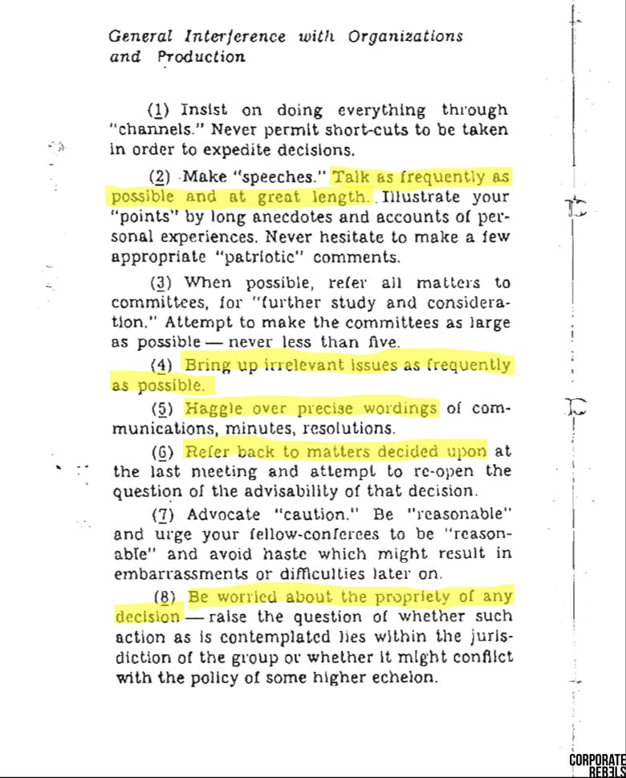

# How to anti-glowie your organisation

> based on 1940s CIA sabotage techniques

1. Always take shortcuts and expedite decisions. If a decision wouldn't
   naturally be made through an official channel the channel should be changed
2. Talk concisely and only when it provides value. Do not speak in platitudes
   or analogies.
3. Decisions are to be made by an individual. If a group decision must be made
   limit the group size to a maximum of 4
4. Keep all discussion on topic
5. Do not argue semantics
6. Only talk about new matters. Do not retread old discussions
7. Argue for expediency and action. Shame and mistakes won't matter when we
   win.
8. Solve the problems presented to you. If you can solve it, it's is in your
   jurisdiction

[SOURCE](https://sloanreview.mit.edu/article/how-to-inadvertently-sabotage-your-organization/)

